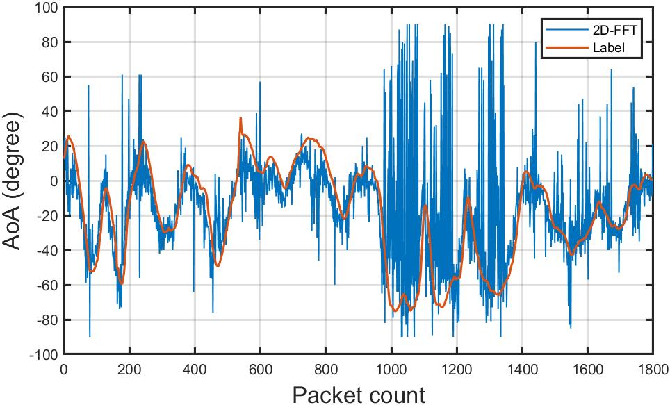
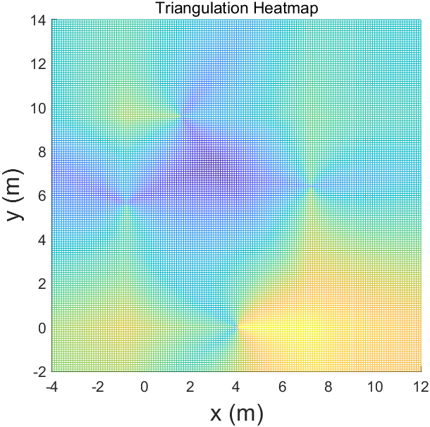

# Human-held devices Dataset.

We construct a human-held devices WiFi localization dataset, consisting of approximately **90k** data points collected from ten volunteers across **four** classic indoor scenarios. 

We believe this dataset provides a more practical view for the future research on WiFi-based localization. 

*Note: This is a beta version of the dataset for review. We will continue to update and improve the relevant description of the dataset.  This dataset will be made publicly available upon acceptance of this work.* 

## Dataset Introduction

For more detailed information about the dataset, please refer to the "Dataset" section in the paper.

## Dataset Structure

### Filename

The format of each .mat filename follows the pattern "RoomName_APName_VolunteerID_InterferenceState". For instance, the filename "Lounge_sRE4_user1_w" indicates that the data was collected in the Lounge, using AP sRE4, with the target user ID 1, while there was simultaneous interference from other individuals. Similarly, the filename "Lab_sRE5_user5_wo" indicates that the data was collected in the Laboratory, using AP sRE5, with the target user ID 5, and there was no interference from other individuals.

### Data

Each .mat file contains a total of six variables.

| Variable Name    | Description                                                  |
| ---------------- | ------------------------------------------------------------ |
| estimations_aoa  | The estimated angles obtained from 2D-FFT.                   |
| features_csi     | The measured CSI information is provided in the format of 1x90. Specifically, it consists of data from three antennas, with each antenna capturing 30 subcarriers. |
| features_rssi    | The measured RSSI information,  with each RSSI formatted as 1x3. |
| labels_aoa       | The label angles.                                            |
| uwb_coordinate_x | The X-axis coordinates obtained from the UWB positioning system. |
| uwb_coordinate_y | The Y-axis coordinates obtained from the UWB positioning system. |

## Example

Here, through a few simple demo programs, we will guide you on how to quickly get started with this dataset. 

### Load a specific data.

As mentioned earlier, each filename in our dataset carries specific meaning. You can simply use the filename as an index to open the desired data.

For example, if you want the data for "Lounge", 'sRE5', 'user3', and 'w', you just need to run **Part 1** of the **demo.mat**.

You can also choose from the following table to select the desired data based on the specific scenarios you are interested in.

| Room Name |       AP Name        | user_id | 
| :-------: | :------------------: | :-----: | 
|  Lounge   | sRE4,sRE5,sRE6,sRE7  |   1-7   |  
|  Office   | sRE22,sRE5,sRE6,sRE7 |   1-5   | 
|    Lab    | sRE22,sRE5,sRE6,sRE7 |   1-5   | 
|    Con    | sRE22,sRE5,sRE6,sRE7 |   1-5   | 

### Experience the variation of Angle of Arrival (AoA).

You can run Part 2 of the demo.mat to experience the variation of AoA with the number of packets. 

### Experience the variation of the trajectory.

You can run Part 3 of the demo.mat to observe the variation of the trajectory.

This figure displays the labeled trajectory of the target person, along with the positions of each AP in space. 

### Experience the example of the localization.

You can run Section 4 to experience a simple triangulation-based localization.

It demonstrates the results of traditional triangulation-based localization using the angle estimation results based on 2D-FFT. 

The heatmap representation of triangulation shows the likelihood of the target being present at each position in space, with smaller values indicating higher probabilities.

All the AP positions and orientations are integrated in the code example, and you can find them in the `obtain_parameters.m` file.

Simultaneously, the results of triangulation are also displayed in the following figure.

### How to access the dataset

We believe that with these basic example codes, you will be able to quickly get started with our constructed dataset and extend it to various upstream tasks.

If you use this dataset, please cite the following paper :

**RLoc: Towards Robust Indoor Localization by Quantifying Uncertainty**

